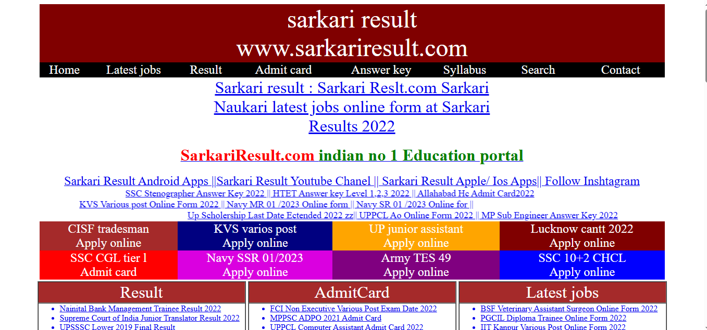
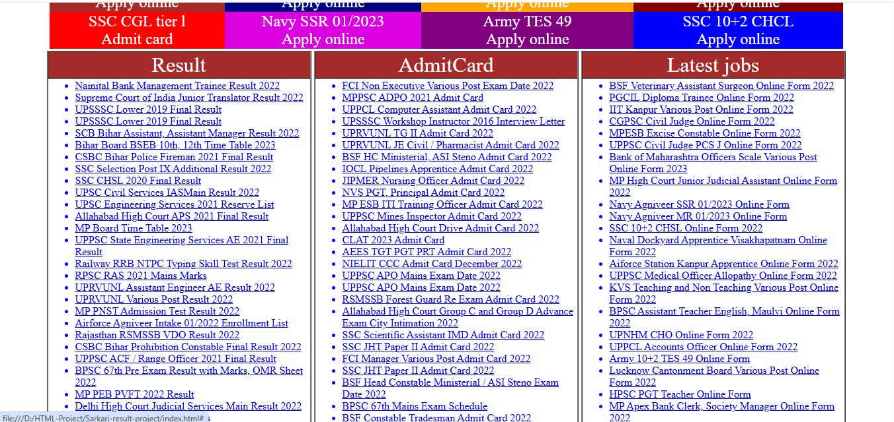
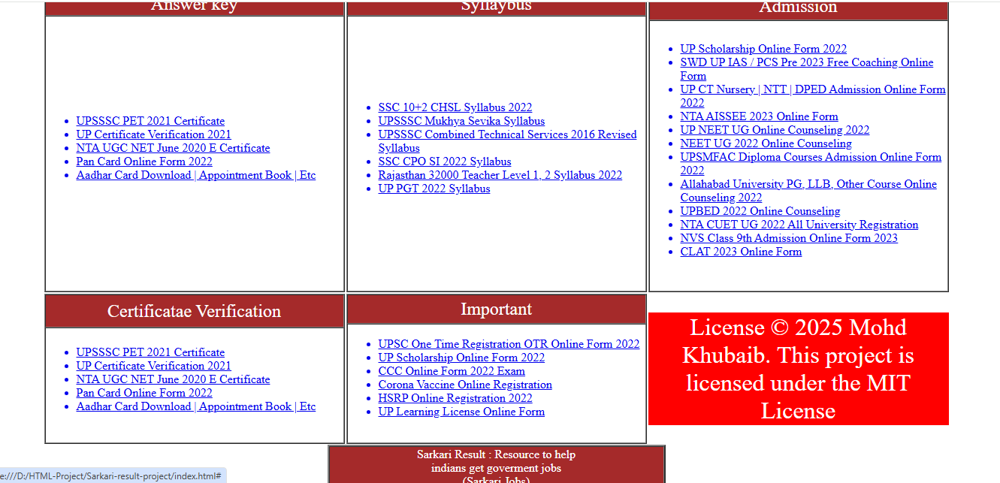
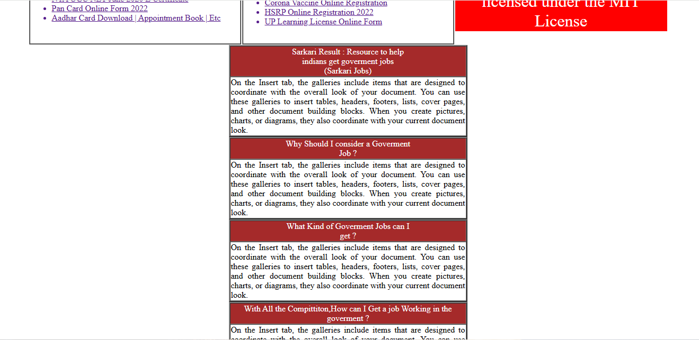

# 🏛️ Sarkari Result Website Clone (HTML Only)

A simple clone of the popular [Sarkari Result](https://www.sarkariresult.com/) website using **only HTML**. Perfect for frontend beginners to practice static web development.

---

## 📋 Features

- ✅ Static HTML layout  
- ✅ Multi-page site (About, Contact, Results, Admit Card)  
- ✅ No CSS or JavaScript — only HTML  
- ✅ Beginner-friendly project

---

## 📸 Screenshot










---

## 🚀 How to Run

- 🔗 [Download the Project Files](https://github.com/your-github-username/sarkari-result-clone/archive/refs/heads/main.zip) *(Replace with actual GitHub link)*  
- Or simply open `index.html` in any browser:

```bash
# Example
double-click index.html
```

---

## 🛠️ Technologies Used

- [HTML5](https://developer.mozilla.org/en-US/docs/Web/HTML)

---

## 📂 Folder Structure

```
Sarkari_Result_Clone/
├── index.html
├── about.html
├── contact.html
├── results.html
├── admit-card.html
├── screenshots/
│   └── sarkari_result_clone.png
└── README.md
```

---

## 📚 Learnings

- ✅ HTML page structure and navigation  
- ✅ Use of semantic tags like `<header>`, `<nav>`, `<section>`, `<footer>`  
- ✅ Static website project flow

---

## 📩 Contact

Made with ❤️ by [Your Name](https://github.com/Mohdkhubaib01)
📧 [mkhubaib543@gmailc.com](mailto:mkhubaib543@gmail.com) 

---

## 📄 License

Released under the [MIT License](LICENSE)
